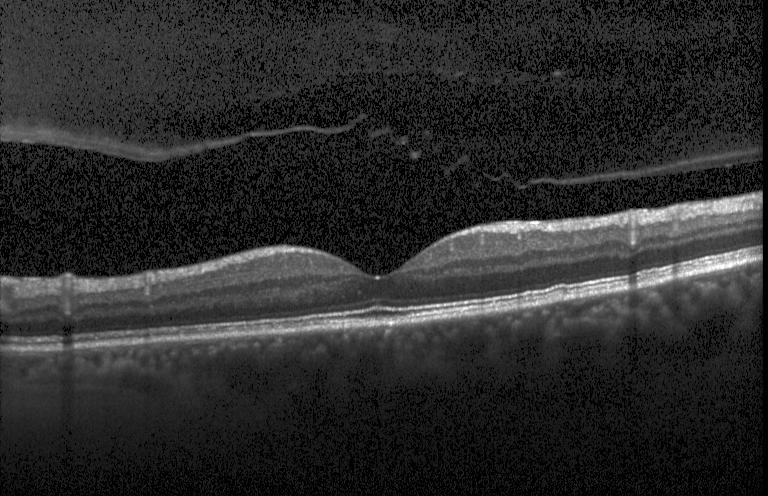

<h1>Retinal Optical Coherence Tomography Classification</h1>

    
    

    In this project, I utilized the ResNet101 architecture to peform image classification on the <a href="https://www.kaggle.com/datasets/paultimothymooney/kermany2018">Retinal OCT dataset</a> into four different classes: normal, choroidal neovascularization (CNV), diabetic macular edema (DME), and Drusen eye disease.

 

    The ultimate goal of this project is not to create a state-of-the-art classification pipeline, but rather a personal exploration into model compression (specifically: quantization-aware training, and iterative pruning) for the purpose of deploying the model to a Raspberry Pi 5 for inference. Thus, I opted to choose the ResNet101 architecture over more-modern architectures such as MobileNet or EfficientNet due to its simplicity and good documentation. 

      

    Normal training on this dataset yielded ~96% accuracy on the testing set. However, in order to prepare the model for deployment in embedded environments, it is necessary to convert the 32-bit floating bit weights to 8-bit integers. Directly making this conversion after training induces quantization noise, which results in a degradation of classification accuracy. 

      

   In order to make the model more robust to quantization noise, I inserted fake quantization operations into the linear layers within the model, then trained as normal as per the documentation from torchao. During inference, this yielded ~95%, which is not a significant drop in accuracy. Confusion matrices for normal and QAT inference are as follows:

      

      

